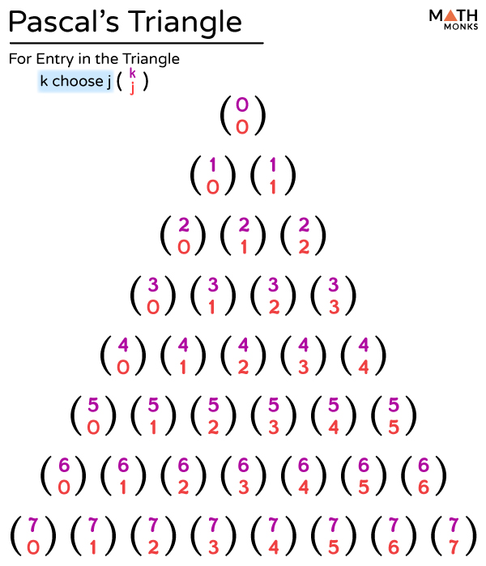

## 1. Fibonacci Numbers

The Fibonacci sequence is defined by the recurrence:  
\[
F(0)=0,\quad F(1)=1,\quad F(n)=F(n-1)+F(n-2) \quad \text{for } n\ge2.
\]

### **Recursive Implementation**

```cpp
// Recursive Fibonacci (exponential time, for small n)
int fib(int n) {
    if(n <= 1)
        return n;
    return fib(n-1) + fib(n-2);
}
```

### **Iterative Implementation**

```cpp
// Iterative Fibonacci (efficient)
void iterativeFib() {
    int a = 0, b = 1;
    // Print or store first two values if needed
    for (int i = 2; i < 10; ++i) {
        int c = a + b;
        a = b;
        b = c;
        // For example, print the current Fibonacci number
        // cout << c << " ";
    }
}
```

### **Precomputed Fibonacci Array**

A static array can store precomputed Fibonacci numbers (e.g., for n up to 46 or so):
```cpp
long long Fib[] = {0, 1, 1, 2, 3, 5, 8, 13, 21, 34, 55, 89,
                     144, 233, 377, 610, 987, 1597, 2584, 4181,
                     6765, 10946, 17711, 28657, 46368, 75025,
                     121393, 196418, 317811, 514229, 832040,
                     1346269, 2178309, 3524578, 5702887, 9227465,
                     14930352, 24157817, 39088169, 63245986,
                     102334155, 165580141, 267914296, 433494437,
                     701408733, 1134903170, 1836311903};
```

---

## 2. GCD & LCM

### **Greatest Common Divisor (GCD)**

GCD is the largest integer that divides two numbers without a remainder. The Euclidean algorithm provides an efficient solution:

```cpp
int gcd(int a, int b) {
    if(b == 0)
        return a;
    return gcd(b, a % b);
}
```

### **Least Common Multiple (LCM)**

The LCM of two numbers is the smallest number that is a multiple of both. It can be calculated using:
\[
\text{lcm}(a, b) = \frac{a \times b}{\text{gcd}(a, b)}
\]

```cpp
int lcm(int a, int b) {
    return (a * b) / gcd(a, b);
}
```

---

## 3. Permutations & Combinations

### **Permutations**

- **Definition:** The number of ordered arrangements of \( n \) objects.
- For all \( n \) objects, it is \( n! \).
- For arranging \( r \) out of \( n \):  
  \[
  P(n, r) = \frac{n!}{(n-r)!}
  \]

### **Combinations**

- **Definition:** The number of ways to choose \( r \) objects from \( n \) without regard to order.
- Given by:  
  \[
  C(n, r) = \frac{n!}{r!(n-r)!}
  \]

### **Pseudo-Code for Permutations and Combinations**

```cpp
// Assume factorial(int n) is defined as:
long long factorial(int n) {
    long long res = 1;
    for (int i = 2; i <= n; ++i)
        res *= i;
    return res;
}

long long permutation(int n, int r) {
    return factorial(n) / factorial(n - r);
}

long long combination(int n, int r) {
    return factorial(n) / (factorial(r) * factorial(n - r));
}
```

*Note:* For large values, direct factorial computations may overflow; using cancellation or logarithms is advised.

## 3.a. Calculating Binomial Coefficient [CP Algorithms Binomial Coefficient](https://cp-algorithms.com/combinatorics/binomial-coefficients.html)



### 1. Basic Implementation (O(k))

max range is 20 for int64_t

```cpp
int C_basic(int n, int k) { // max range is 20 for int64_t
    int res = 1;
    for (int i = n - k + 1; i <= n; ++i)
        res *= i;
    for (int i = 2; i <= k; ++i)
        res /= i;
    return res;
}
```

---

### 2. Improved Implementation (O(k))

 max range is 66 for long double

```cpp
int C_improved(int n, int k) {   // max range is 66 for long double
    double res = 1;
    for (int i = 1; i <= k; ++i)
        res = res * (n - k + i) / i;
    return static_cast<int>(res + 0.01);
}
```

---

### 3. Pascal's Triangle (O(n²)) 
max range is 66 for int64_t

```cpp
const int maxn = 66; // max range is 66 for int64_t
int C_pascal[maxn + 1][maxn + 1];

void build_pascal() {
    C_pascal[0][0] = 1;
    for (int n = 1; n <= maxn; ++n) {
        C_pascal[n][0] = C_pascal[n][n] = 1;
        for (int k = 1; k < n; ++k)
            C_pascal[n][k] = C_pascal[n - 1][k - 1] + C_pascal[n - 1][k];
    }
}
```

---

### 4. __int128 Implementation

max range is 124 for _int128

```cpp
__int128 C_int128(int n, int k) {   // max range is 124 for __int128
    if (k > n - k) k = n - k;
    __int128 res = 1;
    for (int i = 1; i <= k; ++i) {
        res = res * (n - k + i) / i;
    }
    return res;
}

// Helper function to convert __int128 to string for printing
std::string toString(__int128 x) {
    if (x == 0) return "0";
    std::string s;
    bool neg = false;
    if (x < 0) { neg = true; x = -x; }
    while (x > 0) {
        s.push_back('0' + (int)(x % 10));
        x /= 10;
    }
    if (neg) s.push_back('-');
    std::reverse(s.begin(), s.end());
    return s;
}
```

---

### 5. Modular Arithmetic Implementation

For many competitive programming problems, you may need to compute \( C(n, k) \) modulo a prime \( p \). This implementation precomputes factorials and modular inverses up to a maximum \( n \) value using Fermat's little theorem.

*Maximum Range:*  
The maximum \( n \) is determined by the constant `MAXN` (set to \( 1e6 \) here). The results are computed modulo a prime \( p \).

```cpp
#include <iostream>
const int MAXN = 1e6;

long long fac[MAXN + 1];
long long inv[MAXN + 1];

/** 
 * @return x^n modulo m in O(log n) time.
 * Note: Ensure m * m < 2^63 to avoid overflow.
 */
long long exp(long long x, long long n, long long m) {
    x %= m;
    long long res = 1;
    while (n > 0) {
        if (n % 2 == 1) { res = res * x % m; }
        x = x * x % m;
        n /= 2;
    }
    return res;
}

/** Precomputes factorials from 0 to MAXN modulo p. */
void factorial(long long p) {
    fac[0] = 1;
    for (int i = 1; i <= MAXN; i++) { 
        fac[i] = fac[i - 1] * i % p; 
    }
}

/**
 * Precomputes modular inverse factorials from 0 to MAXN modulo p in O(n + log p) time.
 */
void inverses(long long p) {
    inv[MAXN] = exp(fac[MAXN], p - 2, p);
    for (int i = MAXN; i >= 1; i--) { 
        inv[i - 1] = inv[i] * i % p; 
    }
}

/** 
 * @return nCr modulo p.
 */
long long choose(long long n, long long r, long long p) {
    return fac[n] * inv[r] % p * inv[n - r] % p;
}
```

```cpp
#include <iostream>
using namespace std;
using ll = long long;

const int MAXN = 1e6;
const int MOD = 1e9 + 7;

ll fac[MAXN + 1];
ll inv[MAXN + 1];

// BeginCodeSnip{Counting functions}
ll exp(ll x, ll n, ll m) {
	x %= m;
	ll res = 1;
	while (n > 0) {
		if (n % 2 == 1) { res = res * x % m; }
		x = x * x % m;
		n /= 2;
	}
	return res;
}

void factorial() {
	fac[0] = 1;
	for (int i = 1; i <= MAXN; i++) { fac[i] = fac[i - 1] * i % MOD; }
}

void inverses() {
	inv[MAXN] = exp(fac[MAXN], MOD - 2, MOD);
	for (int i = MAXN; i >= 1; i--) { inv[i - 1] = inv[i] * i % MOD; }
}

ll choose(int n, int r) { return fac[n] * inv[r] % MOD * inv[n - r] % MOD; }
// EndCodeSnip

int main() {
	factorial();
	inverses();
	int n;
	cin >> n;
	for (int i = 0; i < n; i++) {
		int a, b;
		cin >> a >> b;
		cout << choose(a, b) << '\n';
	}
}
```

---

## 4. Stirling & Bell Numbers

### **Stirling Numbers**

- **First Kind:** Count the number of permutations of \( n \) elements with exactly \( k \) cycles.
- **Second Kind:** Count the ways to partition a set of \( n \) elements into \( k \) non-empty subsets.  
  The recurrence for the second kind is:
  ```cpp
  // S(n, k) = k * S(n - 1, k) + S(n - 1, k - 1)
  // Base: S(n, 0) = 0 (n > 0), S(0, 0) = 1, S(n, n) = 1
  long long stirlingSecond(int n, int k) {
      if(n == k || k == 1)
          return 1;
      return k * stirlingSecond(n - 1, k) + stirlingSecond(n - 1, k - 1);
  }
  ```

### **Bell Numbers**

- **Definition:** Count the number of partitions of a set with \( n \) elements.
- They can be computed from Stirling numbers by summing:
  \[
  B(n) = \sum_{k=0}^{n} S(n, k)
  \]
  
  A recursive or dynamic programming approach is typically used.

*Note:* These numbers grow rapidly and are often computed using memoization or iterative methods.

---

## 5. Exponentiation: Calculating \(a^p\)

To compute \(a^p\) efficiently, a divide and conquer (recursive) approach is used. This reduces the time complexity to \(O(\log p)\).

```cpp
int power(int b, int p) {
    if(p == 0)
        return 1;
    int sq = power(b, p / 2);
    sq = sq * sq;
    if(p % 2 == 1)
        sq = sq * b;
    return sq;
}
```

---

## 6. Sum of Powers: \(a^1 + a^2 + \ldots + a^p\)

This function computes the sum of powers of \(a\) from 1 to \(p\). The provided code uses recursion and attempts to optimize the computation using a divide and conquer strategy.

### **Pseudo-Code Interpretation**

```cpp
// Returns the sum: a^1 + a^2 + ... + a^k
ll sumPows(ll a, int k) {
    if (k == 0)
        return 0; // Base: sum of zero terms is 0

    // For odd exponent count, use direct multiplication
    if (k % 2 == 1)
        return a * (1 + sumPows(a, k - 1));

    // For even exponent count, divide the problem into halves
    ll half = sumPows(a, k / 2);
    // The formula below is derived to combine results from both halves.
    return half * (1 + half - sumPows(a, k / 2 - 1));
}
```

*Note:* The recurrence for summing powers can vary. The provided function is an attempt to reduce time complexity but might require further derivation or checks for correctness in edge cases.

---

## Conclusion

This code snippet covers several fundamental topics:

1. **Fibonacci Numbers:** Recursive and iterative methods to generate Fibonacci sequences.
2. **GCD & LCM:** Efficient computation using Euclid's algorithm and the relationship \( \text{lcm}(a, b) = \frac{a \times b}{\text{gcd}(a, b)} \).
3. **Permutations & Combinations:** How to calculate the number of ordered and unordered selections.
4. **Stirling & Bell Numbers:** An introduction to counting partitions and cycle-based arrangements.
5. **Exponentiation:** Efficient power calculation via divide and conquer.
6. **Sum of Powers:** A recursive method to calculate the sum \(a^1 + a^2 + \ldots + a^p\).
